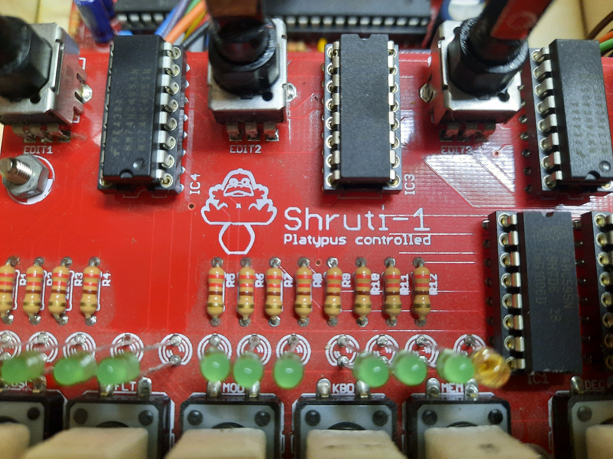
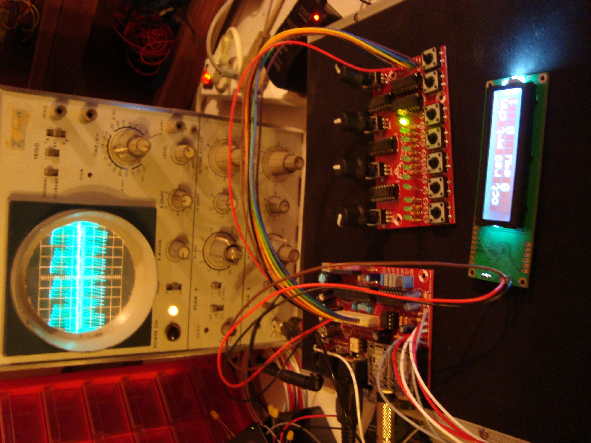
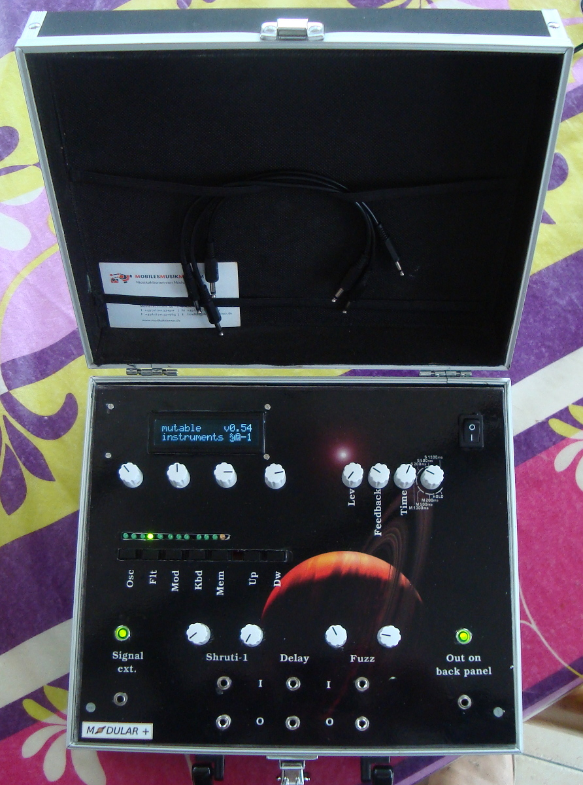
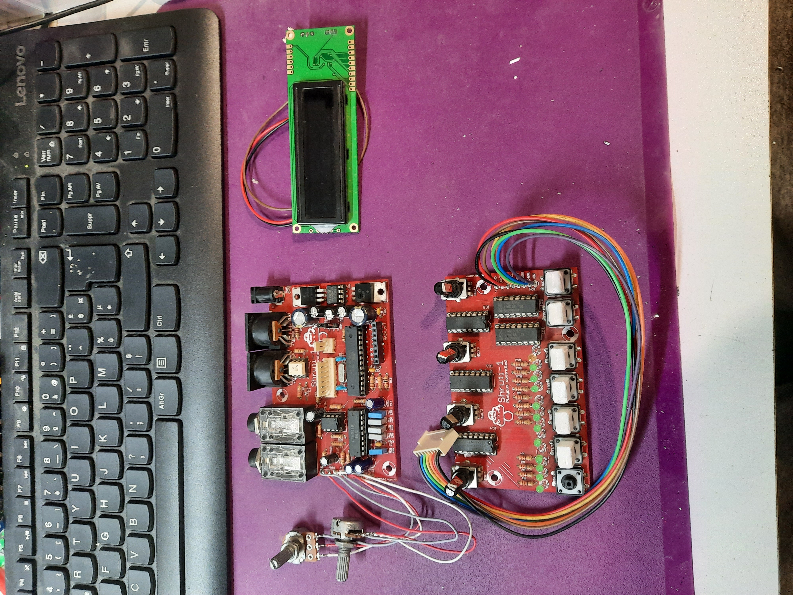
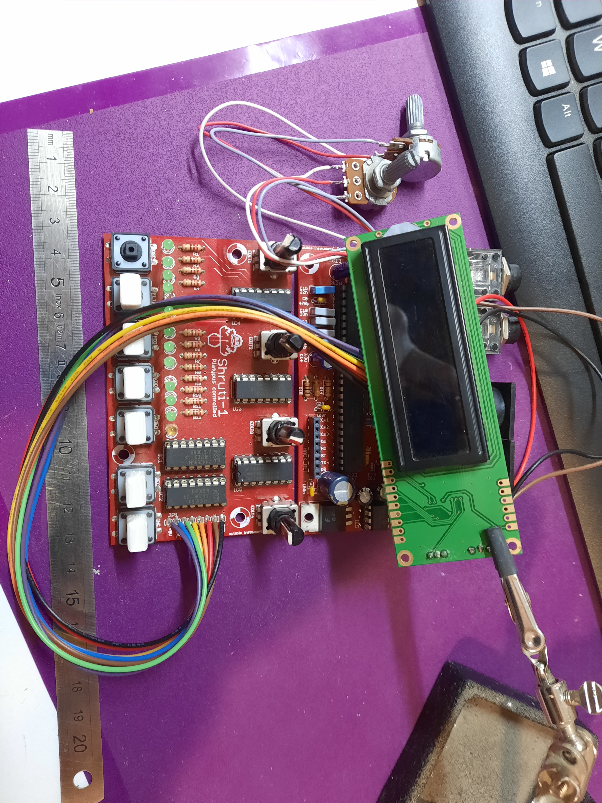
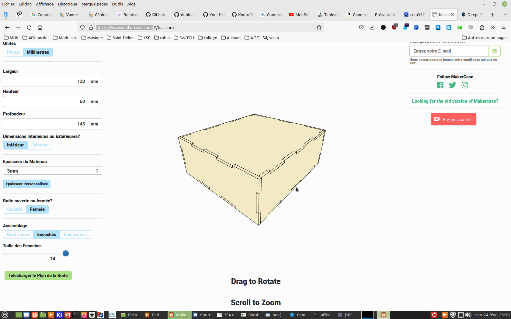
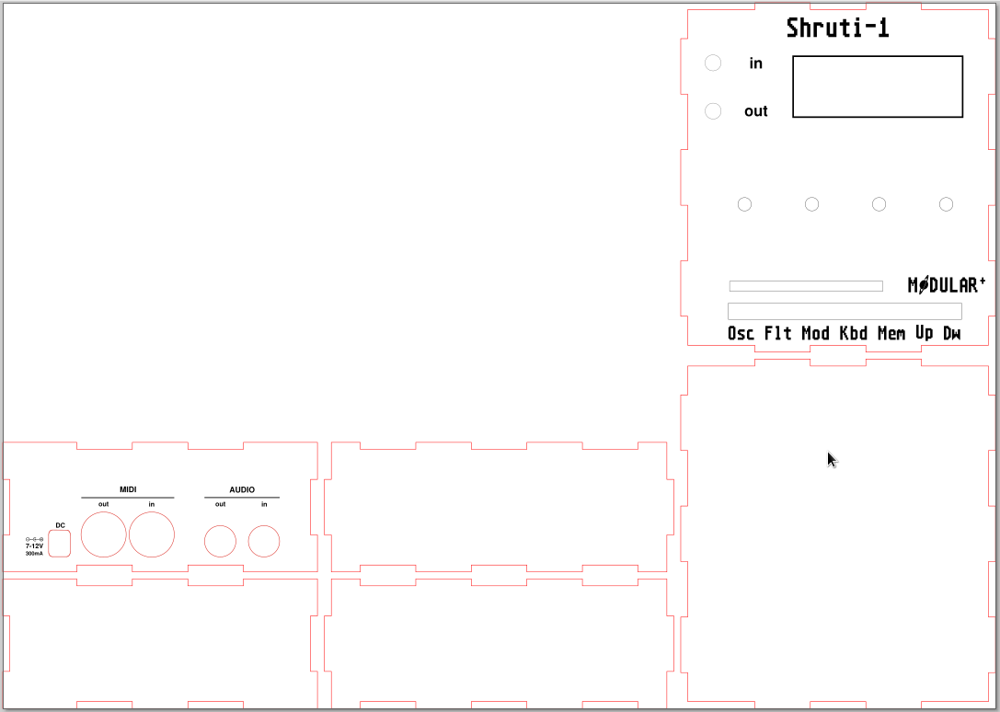
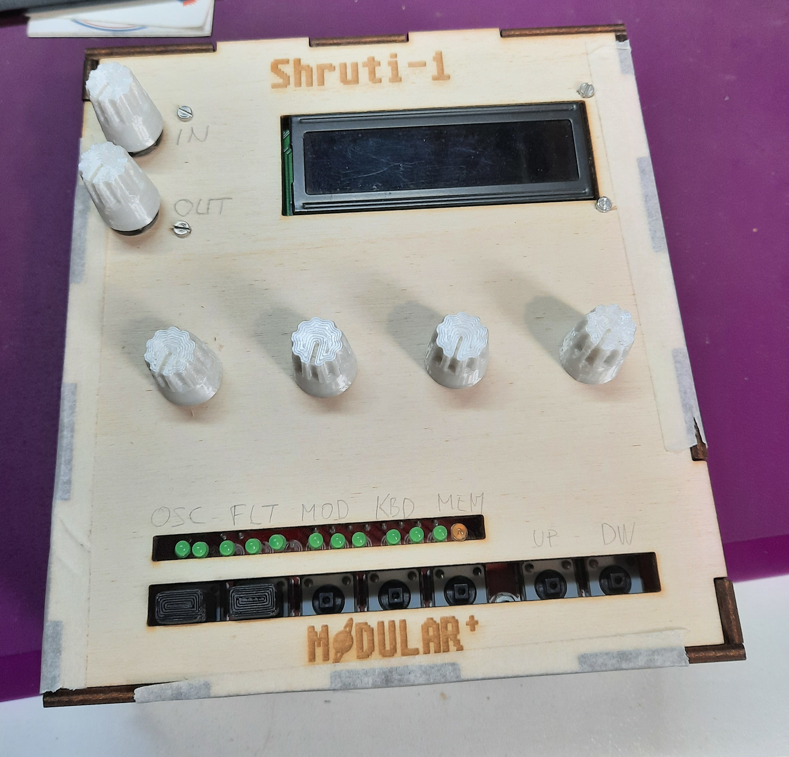

# Shruti-1

New housing for the Shruti-1 

## Design

In 2010 I assembled the Shruti-1 (Without the second H), it's the platypus controlled board, the version before the well-known Shruthi-1 (With the 2nd H, all infos here : https://pichenettes.github.io/mutable-instruments-diy-archive/shruthi/build/).

The pcb's were not yet optimized to be assembled on top of each other.

At the time, I put it in a suitcase along with a broken Behringer delay pedal and a Fuzz "harmonic percolator" pedal circuit.

I put in jack connectors to make them "modular"...

But I realized that I wasn't going to make it with my suitcases, as they take up a lot of space, so the Eurorack saved me ^^.

## 2024 Version

Now we need to make it autonomous.

Make him his own box.

Here's what we've got: the motherboard, the controller board, the screen and 2 potentiometers, one for output volume control (Audio Out 100k Log) and the other for input volume (Audio In 10k Lin).

We're measuring the overall dimensions of the pcb, I've added a little width (3 Cm) to put the 2 potentiometers to the left of the screen.

### Shruti new box

To create the box, there's a great site : https://www.makercase.com/

It's easy to use and lets you create a custom box. Once you've finished entering the width, height and depth values, you can download the plans in either .svg or .dxf format.

### Shruti new box design

I use Inkscape (https://inkscape.org/) to add the holes, the pictures and the text.

*

The files are available here :

Box/Shruti-1_Box V2.svg -> The file which could be modify with inkscape

Box/Shruti-1_Box V2.dxf -> The file vectorised for the laserCutter

### LaserCut and assembly the box

*

### Cap for the button

There are two differents cap for the switchs :

Cap shruti_3.6.stl : Because the genuine button need a square hole in the cap with 3.6mm side

Cap shruti_4.2.stl : Because i need to change a button on the shruti, and, the new reference for this button at mouser need a square hole with 4.2mm side in the cap

In the 3D files folder you could find the freecad files if you want to modify them, and the stl files for the 3D printer

The prototype is finish, i just need to cut another box with the fonction of the buttons

*

